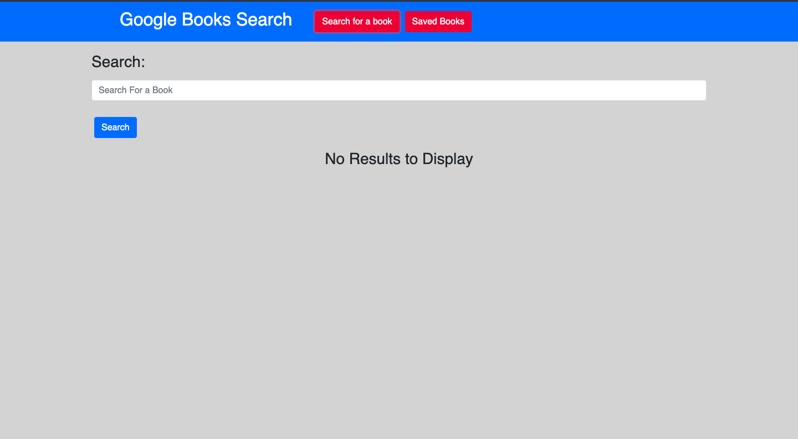
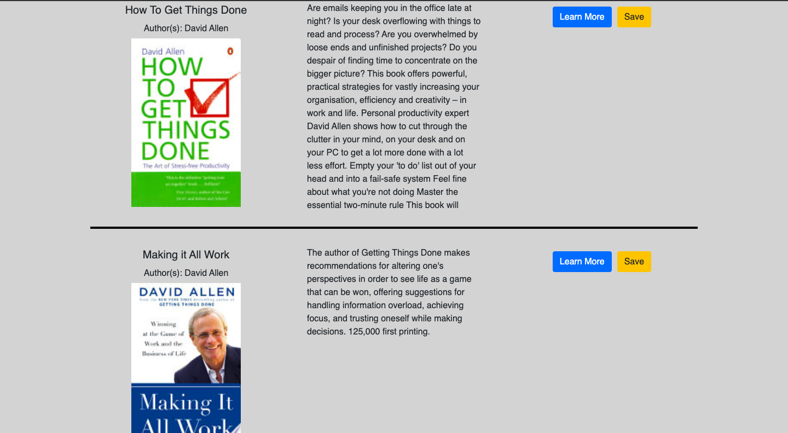
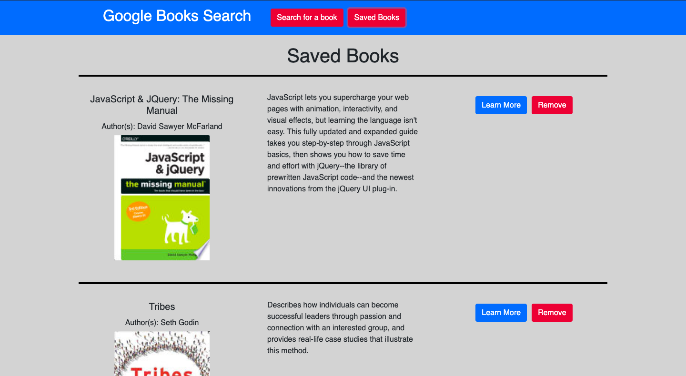

# Google Books Search

With this full stack MERN application, search the Google Books API, save and remove books from your reading list and click to find more information on any book that interests you.

To begin, simply enter your search terms and click "Search".

You will be provided with the ten closest matches to your search terms.  Simply click "Learn More" to be redirected to the Google Books page for the book, or click "Save" to save this book in your reading list.

Click on "Saved Books" in the navigation bar to access your reading list.  From here, you can click "Learn More" to be redirected to the Google Books page for the book, or click "Remove" to remove it from your reading list.

# GitHub Repo:
https://github.com/woodwindscott/book-search/

# Deployed Site:
http://google-books-search-2020.herokuapp.com/

# Technologies used
This project was created with:
* MongoDB
* Express
* NodeJS
* React
* HTML
* CSS
* JavaScript
* Bootstrap

# Future Development Considerations:
1. 

